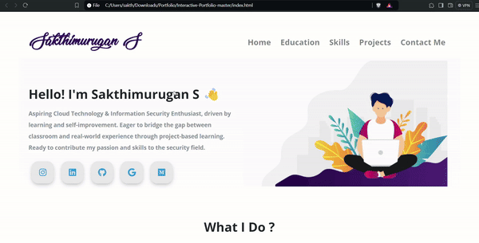

# Interactive-Portfolio 

## A Resposive and attractive portfolio for Developers 🔥
A clean, beautiful and responsive portfolio templete with using only HTML and css.
Later on add some javascript for animation and designing.
visit the website [here.](https://ajitverma15.github.io/Interactive-Portfolio/)

## Sections:
💥 About me\
💥 Education\
💥 Certifications\
💥 Skills\
💥 Projects\
💥 Contact me

## Technology used:
- HTML
- CSS

## Illustration and Images
- [Undraw](https://undraw.co/)
- [Hackerblock](https://hack.codingblocks.com/)

## For the Future
I'm in the process of learning Javascript So,i didn't add any of it 
If you can help us with these.Please don't hesitate to open a pull request.
- Add a page loader
- Add some Animation
- Enable Dark mode
- Add some more Section

## Reference 
This idea are taken from [Ajit Verma](https://github.com/AjitVerma15/masterPortfolio)
